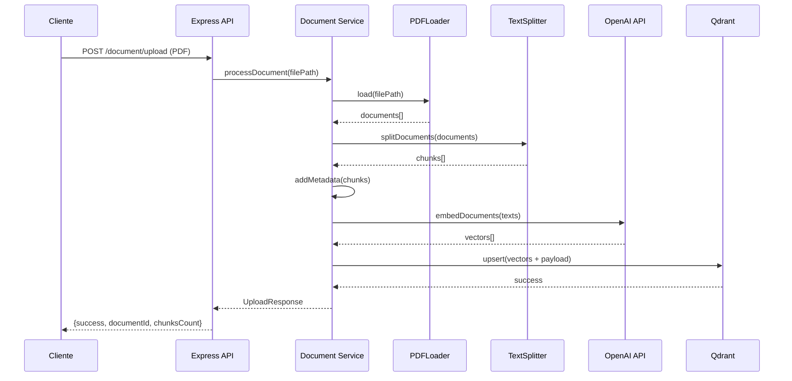
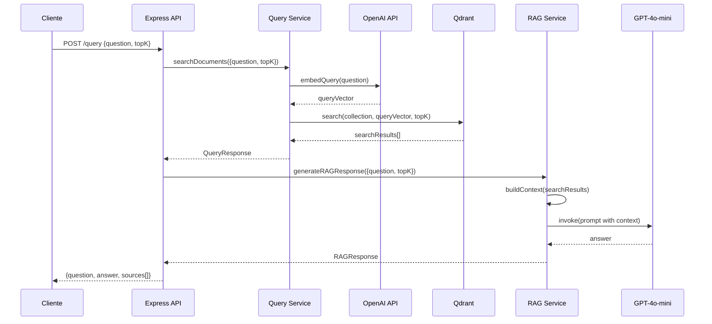

# Apresentação do Projeto RAG
## Retrieval-Augmented Generation System

---

## 📋 Índice

1. [Overview do Projeto](#1-overview-do-projeto)
2. [Tecnologias Utilizadas](#2-tecnologias-utilizadas)
3. [Arquitetura e Fluxo da Aplicação](#3-arquitetura-e-fluxo-da-aplicação)
4. [Estrutura do Código](#4-estrutura-do-código)
5. [Como Usar a Aplicação](#5-como-usar-a-aplicação)
6. [Casos de Uso](#6-casos-de-uso)
7. [Características Técnicas Importantes](#7-características-técnicas-importantes)
8. [Melhorias e Próximos Passos](#8-melhorias-e-próximos-passos)
9. [Pontos de Destaque](#9-pontos-de-destaque)

---

## 1. Overview do Projeto

### O que é RAG?

**RAG (Retrieval-Augmented Generation)** é uma arquitetura de IA que combina recuperação de informações com geração de texto, melhorando significativamente a precisão de Large Language Models (LLMs).

**Princípios Fundamentais:**
- Conecta LLMs a uma base de conhecimento externa
- Reduz alucinações através de informações factualmente verificáveis
- Permite uso de dados privados e atualizados sem retreinar modelos
- Aumenta transparência através de citações de fontes

### O que este projeto faz?

Este projeto implementa uma **API REST completa** que permite:

✅ **Upload de Documentos**: Envio de arquivos PDF para processamento  
✅ **Processamento Inteligente**: Divisão em chunks, geração de embeddings e armazenamento vetorial  
✅ **Consultas Inteligentes**: Perguntas sobre documentos com respostas baseadas em contexto  
✅ **Interface Web**: Interface simples para interação com o sistema  

### Problemas que resolve

| Problema | Solução RAG |
|----------|-------------|
| **Alucinações de LLMs** | Respostas baseadas em documentos verificáveis |
| **Dados desatualizados** | Incorporação de novos dados sem retreinar modelos |
| **Falta de transparência** | Citações automáticas de fontes |
| **Custo elevado** | Solução custo-efetiva para incorporar novos dados |
| **Dados privados** | Processamento de documentos corporativos sem exposição |

---

## 2. Tecnologias Utilizadas

### Backend

#### Runtime e Linguagem
- **Node.js**: Runtime JavaScript assíncrono
- **TypeScript**: Tipagem estática para maior segurança e manutenibilidade

#### Framework e Bibliotecas Core
- **Express.js**: Framework web minimalista para API REST
- **LangChain**: Biblioteca especializada para processamento de documentos e LLMs
  - `@langchain/community`: Loaders de documentos (PDF)
  - `@langchain/core`: Funcionalidades core (prompts, parsers, chains)

#### Serviços Externos
- **OpenAI API**: 
  - `text-embedding-3-small`: Geração de embeddings (1536 dimensões)
  - `gpt-4o-mini`: Modelo de linguagem para geração de respostas

#### Banco de Dados
- **Qdrant**: Banco de dados vetorial especializado para armazenamento e busca de embeddings

#### Utilitários
- **pdf-parse**: Extração de texto de arquivos PDF
- **Multer**: Middleware para upload de arquivos multipart/form-data
- **Zod**: Validação de schemas TypeScript-first
- **UUID**: Geração de IDs únicos para documentos e chunks
- **CORS**: Configuração de Cross-Origin Resource Sharing

### Infraestrutura

- **Docker + Docker Compose**: Containerização do Qdrant para fácil deploy
- **dotenv**: Gerenciamento de variáveis de ambiente

### Frontend (Interface Web)

- **HTML5 + CSS3 + JavaScript Vanilla**: Interface web simples e direta
- **Fetch API**: Comunicação com a API REST

---

## 3. Arquitetura e Fluxo da Aplicação

### Arquitetura Geral

```
┌─────────────────┐
│    Cliente      │
│ (Browser/API)   │
└────────┬────────┘
         │ HTTP/REST
         ▼
┌─────────────────────────────────────┐
│     Express.js API Server           │
│  ┌───────────────────────────────┐ │
│  │  Routes Layer                 │ │
│  │  • /document/upload          │ │
│  │  • /query                    │ │
│  │  • /query/stream            │ │
│  └───────────────────────────────┘ │
│  ┌───────────────────────────────┐ │
│  │  Services Layer              │ │
│  │  • document.ts              │ │
│  │  • query.ts                 │ │
│  │  • rag.ts                   │ │
│  │  • openai.ts                │ │
│  │  • qdrant.ts                │ │
│  └───────────────────────────────┘ │
└────────┬──────────────────┬────────┘
         │                  │
         ▼                  ▼
┌──────────────┐   ┌──────────────┐
│   OpenAI     │   │   Qdrant     │
│   API        │   │  (Vector DB) │
└──────────────┘   └──────────────┘
```

### Fluxo de Upload de Documento



**Etapas Detalhadas:**

1. **Recebimento do Arquivo** (`documentRouter.ts`)
   - Middleware Multer processa upload multipart/form-data
   - Validação de tipo de arquivo (PDF)
   - Armazenamento temporário no servidor

2. **Processamento do Documento** (`services/document.ts`)
   - **Carregamento**: PDFLoader extrai texto e metadados do PDF
   - **Divisão**: RecursiveCharacterTextSplitter divide em chunks de 1000 caracteres com overlap de 200
   - **Metadados**: Adição de documentId, fileName, page, chunkIndex, uploadedAt
   - **Embeddings**: Geração de vetores via OpenAI API (text-embedding-3-small)
   - **Armazenamento**: Upsert no Qdrant com vetores e payload completo

3. **Resposta**
   - Retorna documentId único e quantidade de chunks criados
   - Arquivo temporário é deletado após processamento

### Fluxo de Consulta (Query)



**Etapas Detalhadas:**

1. **Recebimento da Pergunta** (`queryRouter.ts`)
   - Validação com Zod:
     - `question`: String de 1-1000 caracteres
     - `topK`: Número opcional entre 1-10 (padrão: 3)

2. **Busca Vetorial** (`services/query.ts`)
   - Geração de embedding da pergunta via OpenAI
   - Busca por similaridade de cosseno no Qdrant
   - Retorno dos topK chunks mais relevantes com scores de similaridade

3. **Geração da Resposta RAG** (`services/rag.ts`)
   - Construção do contexto numerado a partir dos chunks encontrados
   - Criação do prompt estruturado:
     - System prompt com regras de resposta
     - User prompt com contexto + pergunta
   - Chamada ao LLM (GPT-4o-mini) com temperature 0
   - Formatação da resposta com citações de fontes

4. **Resposta Final**
   - Resposta gerada pelo LLM baseada no contexto
   - Lista de fontes com fileName, page, score
   - Opcional: Streaming via Server-Sent Events

---

## 4. Estrutura do Código

### Organização de Diretórios

```
rag/
├── src/
│   ├── index.ts                 # Ponto de entrada, configuração Express
│   ├── config.ts                # Configurações centralizadas
│   ├── types.ts                 # Interfaces TypeScript
│   ├── routes/
│   │   ├── documentRouter.ts    # Rotas de upload
│   │   └── queryRouter.ts     # Rotas de consulta
│   ├── services/
│   │   ├── document.ts          # Processamento de documentos
│   │   ├── query.ts            # Busca vetorial
│   │   ├── rag.ts              # Orquestração RAG
│   │   ├── openai.ts           # Configuração OpenAI
│   │   └── qdrant.ts           # Cliente Qdrant
│   └── middlewares/
│       └── uplaodMiddleware.ts  # Configuração Multer
├── public/
│   ├── index.html               # Interface web
│   ├── script.js               # Lógica frontend
│   └── styles.css             # Estilos
├── uploads/                    # Arquivos temporários
├── docker-compose.yml          # Configuração Qdrant
├── package.json                # Dependências
└── tsconfig.json              # Configuração TypeScript
```

### Componentes Principais

#### `src/index.ts`
- Inicialização do servidor Express
- Configuração de middlewares (CORS, JSON parser, static files)
- Registro de rotas
- Inicialização da collection Qdrant
- Criação do diretório de uploads

#### `src/config.ts`
- Centralização de configurações
- Leitura de variáveis de ambiente
- Valores padrão para desenvolvimento

#### `src/types.ts`
- Interfaces TypeScript para type safety:
  - `UploadResponse`: Resposta de upload
  - `QueryRequest/Response`: Requisições e respostas de consulta
  - `RAGResponse`: Resposta final com fontes
  - `SearchResult`: Resultado de busca vetorial

#### `src/routes/documentRouter.ts`
- **POST `/document/upload`**: Endpoint para upload de PDFs
- Validação de arquivo
- Deleção de arquivo temporário após processamento

#### `src/routes/queryRouter.ts`
- **POST `/query`**: Consulta síncrona
- **POST `/query/stream`**: Consulta com streaming (SSE)
- Validação de entrada com Zod

#### `src/services/document.ts`
- `processDocument()`: Pipeline completo de processamento
  1. Load PDF
  2. Split em chunks
  3. Add metadata
  4. Generate embeddings
  5. Store no Qdrant

#### `src/services/query.ts`
- `searchDocuments()`: Busca vetorial no Qdrant
- Geração de embedding da query
- Retorno de resultados ordenados por relevância

#### `src/services/rag.ts`
- `generateRAGResponse()`: Geração de resposta completa
- `generateRAGStreamingResponse()`: Versão streaming
- Construção de contexto e prompt
- Integração com LangChain

#### `src/services/openai.ts`
- Configuração de embeddings (OpenAIEmbeddings)
- Configuração de LLM (ChatOpenAI)
- Timeouts e retry logic

#### `src/services/qdrant.ts`
- Cliente Qdrant REST
- `initQdrantCollection()`: Criação automática de collection
- Configuração de vetores (1536 dimensões, Cosine distance)

---

## 5. Como Usar a Aplicação

### Pré-requisitos

- **Node.js** versão 20 ou superior
- **Docker** e **Docker Compose** instalados
- **Chave de API OpenAI** válida
- Editor de código (opcional, mas recomendado)

### Configuração Passo a Passo

#### 1. Clone e Instalação

```bash
# Clone o repositório (se aplicável)
git clone <repository-url>
cd rag

# Instale as dependências
npm install
```

#### 2. Configuração de Variáveis de Ambiente

Crie um arquivo `.env` na raiz do projeto:

```env
# Server Settings
PORT=3333

# Qdrant Settings
QDRANT_API_URL=http://localhost:6333
QDRANT_COLLECTION=documents

# OpenAI Settings
OPENAI_API_KEY=sk-sua-chave-aqui

# Upload Settings
UPLOAD_DIR=./uploads
```

#### 3. Iniciar Serviços

```bash
# Inicie o Qdrant via Docker Compose
docker-compose up -d

# Verifique se o Qdrant está rodando
curl http://localhost:6333/health

# Inicie o servidor da API
npm run dev
```

O servidor estará disponível em `http://localhost:3333`

### Endpoints da API

#### POST `/document/upload`

**Descrição**: Upload e processamento de arquivo PDF

**Request:**
- Method: `POST`
- Content-Type: `multipart/form-data`
- Body: Campo `file` com arquivo PDF

**Response:**
```json
{
  "success": true,
  "documentId": "uuid-do-documento",
  "chuncksCount": 150,
  "message": "Document processed successfully"
}
```

**Exemplo com curl:**
```bash
curl -X POST http://localhost:3333/document/upload \
  -F "file=@/caminho/para/documento.pdf"
```

#### POST `/query`

**Descrição**: Consulta síncrona sobre documentos

**Request:**
```json
{
  "question": "Qual foi a receita da empresa em 2023?",
  "topK": 3
}
```

**Response:**
```json
{
  "question": "Qual foi a receita da empresa em 2023?",
  "answer": "De acordo com o relatório anual [1], a receita foi de $50 bilhões...",
  "sources": [
    {
      "fileName": "relatorio2023.pdf",
      "page": 15,
      "score": 0.92
    }
  ]
}
```

**Exemplo com curl:**
```bash
curl -X POST http://localhost:3333/query \
  -H "Content-Type: application/json" \
  -d '{"question": "Qual foi a receita?", "topK": 3}'
```

#### POST `/query/stream`

**Descrição**: Consulta com streaming de resposta (Server-Sent Events)

**Request:** Igual ao `/query`

**Response:** Stream de eventos SSE:
```
data: {"type": "sources", "content": [...]}

data: {"type": "token", "content": "De"}

data: {"type": "token", "content": " acordo"}

...

data: [DONE]
```

### Interface Web

Acesse `http://localhost:3333` no navegador para usar a interface web:

1. **Upload**: Selecione um arquivo PDF e clique em "Upload"
2. **Pergunta**: Digite sua pergunta e clique em "Send"
3. **Resposta**: Visualize a resposta e as fontes citadas

---

## 6. Casos de Uso

### Aplicações Práticas

#### 1. Suporte ao Cliente
- **Cenário**: Chatbot que responde perguntas baseadas em manuais e políticas
- **Benefício**: Respostas precisas e verificáveis
- **Exemplo**: "Qual é a política de devolução?"

#### 2. Assistentes de Pesquisa Corporativa
- **Cenário**: Sistema de busca em documentação interna
- **Benefício**: Encontra informações rapidamente em grandes volumes de documentos
- **Exemplo**: "Quais são os procedimentos de segurança?"

#### 3. Sistemas Q&A sobre Documentos Complexos
- **Cenário**: Respostas sobre documentos legais, científicos ou técnicos
- **Benefício**: Compreensão de documentos longos e complexos
- **Exemplo**: "Quais são os principais riscos mencionados no relatório?"

#### 4. Análise de Relatórios
- **Cenário**: Extração de insights de relatórios anuais, financeiros, etc.
- **Benefício**: Análise rápida de documentos extensos
- **Exemplo**: "Quais foram as principais conquistas do ano?"

#### 5. Educação e Tutoria
- **Cenário**: Tutor baseado em materiais didáticos
- **Benefício**: Respostas contextualizadas pelos materiais do curso
- **Exemplo**: "Explique o conceito de RAG usando os materiais do curso"

### Exemplo Real: Análise de Relatório Anual

**Documento**: `NIKE10K2023.pdf` (Relatório anual da Nike)

**Pergunta**: "Qual foi a receita total da Nike em 2023?"

**Processo**:
1. Sistema busca chunks relevantes sobre receita/financeiro
2. Encontra trechos do relatório com informações financeiras
3. LLM gera resposta baseada nos trechos encontrados
4. Resposta inclui citação da página específica

**Resposta Esperada**:
> "De acordo com o relatório anual [1], a receita total da Nike em 2023 foi de aproximadamente $51.2 bilhões, representando um crescimento de 10% em relação ao ano anterior. Esta informação está na página 45 do documento."

---

## 7. Características Técnicas Importantes

### Processamento de Documentos

| Parâmetro | Valor | Justificativa |
|-----------|-------|---------------|
| **Chunk Size** | 1000 caracteres | Balance entre contexto e precisão |
| **Chunk Overlap** | 200 caracteres | Preserva contexto entre chunks adjacentes |
| **Metadados** | documentId, fileName, page, chunkIndex | Rastreabilidade completa |

**Estratégia de Divisão:**
- `RecursiveCharacterTextSplitter`: Divide respeitando estrutura do texto
- Overlap garante que informações não sejam perdidas nas bordas dos chunks
- Metadados permitem rastrear origem de cada resposta

### Busca Vetorial

| Parâmetro | Valor | Justificativa |
|-----------|-------|---------------|
| **Modelo de Embedding** | text-embedding-3-small | Balance entre qualidade e custo |
| **Dimensões** | 1536 | Dimensões do modelo escolhido |
| **Métrica** | Cosine Similarity | Padrão para embeddings de texto |
| **TopK Padrão** | 3 | Balance entre relevância e contexto |

**Como Funciona:**
1. Pergunta é convertida em vetor de 1536 dimensões
2. Qdrant calcula similaridade de cosseno com todos os vetores armazenados
3. Retorna os topK vetores mais similares
4. Scores indicam nível de relevância (0-1)

### Geração de Respostas

| Parâmetro | Valor | Justificativa |
|-----------|-------|---------------|
| **Modelo LLM** | GPT-4o-mini | Balance entre qualidade e custo |
| **Temperature** | 0 | Respostas determinísticas e consistentes |
| **Max Retries** | 2 | Resiliência a falhas temporárias |
| **Timeout** | 20s | Evita esperas infinitas |

**Prompt Engineering:**
- System prompt define regras claras de comportamento
- Contexto é numerado para facilitar citações
- Instruções específicas para português brasileiro
- Regras para quando informação não é encontrada

### Performance e Confiabilidade

- **Timeouts Configurados**: Evita esperas infinitas
- **Retry Logic**: Resiliência a falhas temporárias de APIs
- **Streaming Disponível**: Melhor UX para respostas longas
- **Validação Robusta**: Zod garante integridade dos dados

---

## 8. Melhorias e Próximos Passos

### Melhorias Funcionais

#### Curto Prazo
- ✅ **Suporte a Múltiplos Formatos**
  - DOCX, TXT, Markdown
  - Processamento de imagens com OCR
- ✅ **Melhorias na Interface Web**
  - Design mais moderno e responsivo
  - Histórico de conversas
  - Visualização de documentos

#### Médio Prazo
- ✅ **Autenticação e Autorização**
  - JWT tokens
  - Múltiplos usuários
  - Permissões por documento
- ✅ **Múltiplas Coleções**
  - Organização por projeto/usuário
  - Namespaces para isolamento
- ✅ **Histórico de Conversas**
  - Armazenamento de perguntas e respostas
  - Contexto de conversa
  - Exportação de conversas

### Melhorias Técnicas

#### Performance
- ✅ **Cache de Respostas**
  - Cache de perguntas frequentes
  - Redução de custos de API
- ✅ **Otimização de Embeddings**
  - Batch processing
  - Cache de embeddings similares
- ✅ **Indexação Avançada**
  - Híbrid search (vetorial + keyword)
  - Re-ranking de resultados

#### Escalabilidade
- ✅ **Rate Limiting**
  - Proteção contra abuso
  - Quotas por usuário
- ✅ **Queue System**
  - Processamento assíncrono de uploads grandes
  - Background jobs
- ✅ **Load Balancing**
  - Múltiplas instâncias
  - Distribuição de carga

### Considerações de Produção

#### Segurança
- ✅ Validação robusta de arquivos (tamanho, tipo, conteúdo)
- ✅ Sanitização de inputs
- ✅ Proteção contra injection attacks
- ✅ HTTPS obrigatório

#### Monitoramento
- ✅ Logging estruturado (JSON logs)
- ✅ Métricas de performance (latência, throughput)
- ✅ Alertas para erros críticos
- ✅ Dashboard de monitoramento

#### Testes
- ✅ Testes unitários (Jest/Vitest)
- ✅ Testes de integração
- ✅ Testes end-to-end
- ✅ Testes de carga

#### DevOps
- ✅ Health checks (`/health` endpoint)
- ✅ CI/CD pipeline
- ✅ Containerização completa (Docker)
- ✅ Kubernetes deployment (opcional)

---

## 9. Pontos de Destaque

### Diferenciais Técnicos

#### Arquitetura
- ✅ **Modular e Bem Estruturada**: Separação clara de responsabilidades
- ✅ **Type Safety**: TypeScript em todo o código
- ✅ **Escalável**: Fácil adicionar novos formatos ou modelos

#### Tecnologias Modernas
- ✅ **LangChain**: Biblioteca líder para LLM applications
- ✅ **Qdrant**: Banco vetorial de alta performance
- ✅ **OpenAI**: Modelos state-of-the-art

#### Funcionalidades Avançadas
- ✅ **Streaming**: Respostas em tempo real
- ✅ **Metadados Ricos**: Rastreabilidade completa
- ✅ **Citações Automáticas**: Transparência nas respostas

### Impacto e Valor

#### Para Desenvolvedores
- ✅ **Código Limpo**: Fácil de entender e manter
- ✅ **Bem Documentado**: Comentários e tipos claros
- ✅ **Extensível**: Arquitetura permite customizações

#### Para Usuários
- ✅ **Fácil de Usar**: Interface simples e intuitiva
- ✅ **Respostas Precisas**: Baseadas em documentos reais
- ✅ **Transparente**: Fontes sempre citadas

#### Para o Negócio
- ✅ **Custo-Efetivo**: Não requer retreinar modelos
- ✅ **Rápido de Implementar**: Solução pronta para uso
- ✅ **Escalável**: Suporta crescimento

### Demonstração de Conhecimento

Este projeto demonstra conhecimento em:
- ✅ **IA/ML Aplicado**: RAG, embeddings, LLMs
- ✅ **Arquitetura de Software**: Design patterns, separação de concerns
- ✅ **APIs REST**: Design de endpoints, validação, error handling
- ✅ **Banco de Dados Vetoriais**: Busca semântica, similaridade
- ✅ **DevOps**: Docker, configuração de ambiente
- ✅ **TypeScript**: Type safety, interfaces, generics

---

## 📚 Recursos Adicionais

### Documentação
- [LangChain Documentation](https://js.langchain.com/)
- [Qdrant Documentation](https://qdrant.tech/documentation/)
- [OpenAI API Reference](https://platform.openai.com/docs)

### Aprendizado
- [RAG: Retrieval-Augmented Generation Explained](https://www.pinecone.io/learn/retrieval-augmented-generation/)
- [Vector Databases Explained](https://www.pinecone.io/learn/vector-database/)

---

## 📞 Contato

**Autor**: Thiago Braga  
**Projeto**: RAG System  
**Versão**: 1.0.0

---

*Documento gerado para apresentação do projeto RAG - Retrieval-Augmented Generation System*
